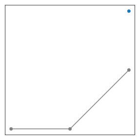

# Assign points to a bunch

When tracking particles, we need to assign their latest position to their past trajectories. We could use the `assign` method of `BrownTrack` to [do so](./assignment.md), but the convenience method `bunch.assign` makes it easier.

Let's first create an empty bunch.

```python
import BrownTrack as BT

bunch = BT.bunch()
```
We now populate this bunch with a new point. Since the bunch contains no trajectory at this stage, the new point cannot be assigned to a trajectory, and a new one must be created.

```python
bunch.assign( [ [0,0] ] )
print( bunch.live_trajectories )
```

```console
>>> [<BrownTrack.trajectory.trajectory object at 0x7f880f703e10>]
```

Let's now add a new point on this trajectory, and check the result.

```python
bunch.assign( [ [.1,0] ] )

for traj in bunch.live_trajectories :
    print( traj.x, traj.y )
```

```console
>>> [0, 0.1] [0, 0]
```

And yet another point.

```python
bunch.assign( [ [.2,.1] ] )

print( len( bunch.live_trajectories ), len( bunch.dead_trajectories ) )
```

```console
>>> 1 0
```

There is still a single live trajectory, and no dead one. That's because the new points we've added so far were all close to the last point of the live trajectory, so they were assigned to it. (By default, the `mismatch_length` argument of the `bunch.assign` method is 1.)

We now add a new point that's too far from the live trajectory, and plot the result.

```python
bunch.assign( [ [.2,.2] ], mismatch_length = .01 )

from pylab import *

for trajectory in bunch.dead_trajectories :
    plot( trajectory.x, trajectory.y, '-o', color = 'grey' )

for trajectory in bunch.live_trajectories :
    plot( trajectory.x, trajectory.y, '-o', color = 'tab:blue' )
```


A new trajectory has been created to accommodate the new point, and the trajectory that didn't grow is now dead.
