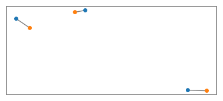
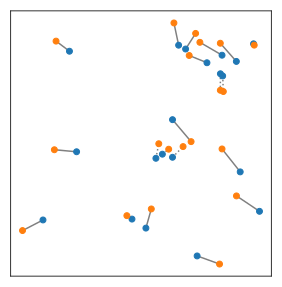

# Assignment

To build the trajectories of moving particles, we need to identify them, and follow them individually. When this is not possible, one workaround is to guess which particle is which on two successive sets of position. To do so, we try to assign to each particle in the first set a particle in the next---hopefully its new position.

BrownTrack uses the Kuhn-Munkres algorithm as implementend in the [munkres library](https://pypi.org/project/munkres/) to do this.

## Successive sets of points

Let's create one set of random points, and then move them around a bit.

```python
from pylab import *

X1 = rand( 3, 2 )
X2 = X1 + .2*( rand( *shape( X1 ) ) - .5 )
```
Assuming we lost track of which point is which in both sets, we can try to pair them based on their relative distance.

```python
import BrownTrack as BT

links = BT.assign( X1, X2, 1 )
print(links)
```
```console
>>> [(0, 0), (1, 1), (2, 2)]
```
That the indices are the same for all pairs shows that the algorithm did well. This was easy, because the points didn't move much, and weren't too numerous.

We now plot our pairing.

```python
for link in links :

    if link[0] == link[1] : # then the pairing is correct
        linestyle = '-'
    else :
        linestyle = ':'

    plot( *array( [ X1[ link[0] ], X2[ link[1] ] ] ).T, color = 'grey', linestyle = linestyle, zorder = -1 )
```



## Time resolution

When the particles have moved too much between two successive tracking times, they'll be hard to pair. The code above run with 20 points instead of 3 shows the problem. Dotted lines show wrong pairs.


