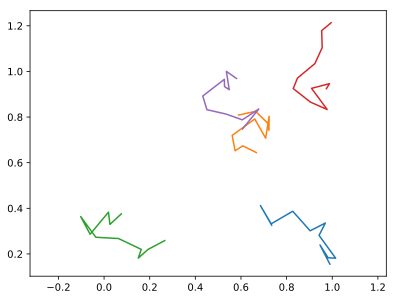

# Bunch

A bunch is a series of trajectories. Some of them are alive, which means they can grow as new points are added to them, whereas other are dead---they're no longer able to grow.

## Creation

Let us create an empty bunch.
```python
import BrownTrack as BT
swarm = BT.bunch( live_trajectories = [], dead_trajectories = [] )
```
We can now populate the bunch with new live trajectories.
```python
from pylab import *

for _ in range(5) :
    new_trajectory = BT.trajectory( X = rand( 2 ) )
    swarm.addTrajectory( new_trajectory )
```
Now, the bunch has five live trajectories, and no dead ones.
```python
print( swarm.live_trajectories )
print( swarm.dead_trajectories )
```
```console
>>> [<BrownTrack.trajectory.trajectory object at 0x7ff1c0c3d438>, <BrownTrack.trajectory.trajectory object at 0x7ff1c0c3d400>, <BrownTrack.trajectory.trajectory object at 0x7ff1c0b86cf8>, <BrownTrack.trajectory.trajectory object at 0x7ff1c0b86d68>, <BrownTrack.trajectory.trajectory object at 0x7ff1c0b86da0>]
>>> []

```

## Growth

To grow a bunch, we need to specify which trajectories grow, and what points are to be added to them. Let's say first that all five trajectories grow.
```python
tracks = []
new_points = []

for traj_index in range( len( swarm.live_trajectories ) ) :

    new_points += [ array( swarm.live_trajectories[traj_index].getEnd() ) + 0.2*( rand( 2 ) - .5 ) ]
    tracks += [ [ traj_index ]*2 ]

swarm.grow( tracks = tracks, new_points = new_points )
```
After this, all trajectories have grown a bit. After repeating the above ten times, our bunch has become a collection of random walkers.
```python
for trajectory in swarm.live_trajectories :
    plot( trajectory.x, trajectory.y )
```
Here is how the trajectories look like:


