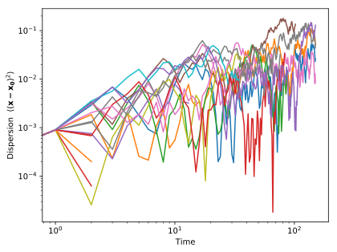

# Diffusivity

We would like to measure the diffusivity of Brownian particles.

## Random walkers

We first generate a circular box where the random walkers are confined.
```python
import BrownTrack as BT

box = BT.domain( patch_type = 'Circle', boundary = { 'xy': ( 0, 0 ), 'radius' : 1 } )
```
We then creates a bunch of trajectories to represent the random walkers.
```Python
from pylab import *

epsilon = 0.03 # step size of the random walk

trajectories = BT.bunch()

for _ in range(10) :
    z = box.boundary['radius']*rand()*exp( 1j*2*pi*rand() )
    trajectories.addTrajectory( BT.trajectory( ( real(z), imag(z) ) ) )
```
Finally, we walk the walkers.
```python
for t in range(150) :
    for traj in trajectories.live_trajectories :

        ########### new position

        dz = epsilon*exp( 1j*2*pi*rand() )
        x, y = array( traj.getEnd() ) + array( [ real(dz), imag(dz) ] )

        ########### boundaries

        z = x + 1j*y
        r = abs(z)

        if r > box.boundary['radius'] :
            z = z*( 2*box.boundary['radius'] - r )/r
            x, y = real(z), imag(z)

        ########## grow trajectory

        traj.addPoint( [ x, y ] )
```
The resulting trajectories look like this:
```python
for trajectory in trajectories.live_trajectories :
    ax_phy.plot( trajectory.x, trajectory.y )
```


## Measurement area

To measure the diffusivity of our walkers, we want to use only the part of the trajectories that are far enough from the boundaries. We first define a smaller box.
```python
small_box = box.deepcopy()
small_box.boundary['radius'] -= 10*epsilon
```
We then select the parts of the trajectories that are inside this smaller box.
```Python
inside, outside = small_box.cookie_cutter( trajectories.live_trajectories )
```
We can now plot the resluting trajectories.
```Python
for traj in inside :
  plot( x**2 + y**2, alpha = .3 )

for traj in outside :
    plot( traj.x, traj.y, color = 'gray', alpha = .25 )
```


## Dispersion

To measure the dispersion of the walkers, we first need shift each trajectory so that it starts from the origin. We then compute the evolution of the squared distance to the origin as time goes.
```python
for traj in inside :
    x, y = traj.x - traj.x[0], traj.y - traj.y[0]
    plot( x**2 + y**2 )
```
As expected, the squared distance to the origin grows linearly with time:



The diffusivity is the prefactor of this relation. To estimate it based on our trajectory, we treat all the above point as a single data set. A quick way to do so is:
```Python
time, r2 = BT.dispersion( inside )
```
(This function works only when the random walk is unbiased. A safer, more recent function is `BT.dispersion_2`).

We then need to average this data over bins, using for instance the [bindata](https://github.com/odevauchelle/bindata) library.
```Python
from bindata import bindata

data = bindata( time, r2, bins = 'log', nbins = 6 )
time, r2 = data.apply( mean )
```
To estimate the error associated to each average, we compute the standard deviation for each bin, and divide by the square root of the number of points in each bin.
```python
sigma_time, sigma_r2 = data.apply( std )
nb = data.nb
error_time, error_r2 = sigma_time/sqrt( nb ), sigma_r2/sqrt( nb )
```
The result looks like this:
```python
errorbar( time, r2, sigma_r2, sigma_time, 'o', label = 'Binned data' )
ax_std.plot( time, epsilon**2*time, '--', color = std_color, label = 'Theory' )
```


The value of the diffusivity can be estimated by fitting a linear relationship to the data, but there are [better estimators](./diffusivity_estimators.md).
