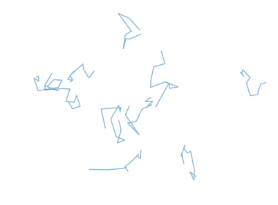
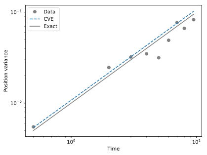

# Diffusivity estimators

When we want to estimate the diffusivity of a random walker based on its trajectory, fitting a power-law to its variance might not be the best option.

## Covariance-based estimator

Let us first consider the case of classical Brownian motion, for which we have access to discrete positions, measured at a frequency much lower than the inverse correlation time.

We first make such a random walker:

```python
from pylab import *
import BrownTrack as BT

u0 = .1
N = 10

# initial locations

for _ in range(N) :
    trajectories.addTrajectory( BT.trajectory( normal( scale = u0, size = 2 ) ) )

# time loop

for _ in range(10) :
    trajectories.grow( new_points = trajectories.getEnds() + normal( scale = u0, size = ( N, 2 ) ) )
```
We have a small number of short trajectories. Here is how they look like

```python
for traj in trajectories.live_trajectories :
    ax.plot( traj.x, traj.y, color = 'tab:blue', alpha = .5 )
```



The function `BT.diffusivity_2D` uses a covariance-based estimator to estimate the diffusivity from the trajectories:

```python
Dx, Dy = BT.diffusivity_2D( trajectories.live_trajectories )
```
The default estimator was proposed in [this paper](https://doi.org/10.1103/PhysRevX.10.021009):

*Frishman, A., & Ronceray, P. (2020). Learning force fields from stochastic trajectories. Physical Review X, 10(2), 021009.*

To check it, we first plot the variance of the positions as a function of time:

```python
from bindata import bindata

disp = BT.dispersion_2( trajectories.getAllTrajectories(), dim = 'y' )

binned_data = bindata( disp['time'], disp['y'], nbins = 10 )
t, _ = binned_data.apply(mean)
_, sigma = binned_data.apply(var)

plot( t, sigma, 'o', color = 'grey', label = 'Data' )
```

We then compare with the estimator result, and the theoretical value:

```Python
t_th = linspace( min(t), max(t), 5)
plot( t_th, 2*Dy*t_th, '--', label = 'CVE' )
plot( t_th, u0**2*t_th, '-', color = 'grey', zorder = -1, label = 'Exact' )
legend()
```



The covariance-based estimator provides a reliable estimate in this case.


## Auto-correlation function
