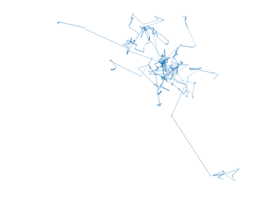
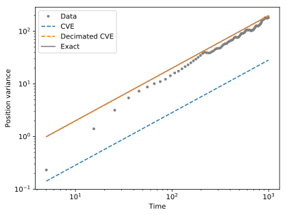
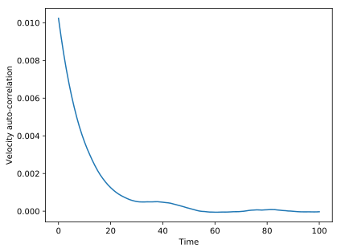
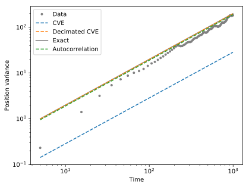
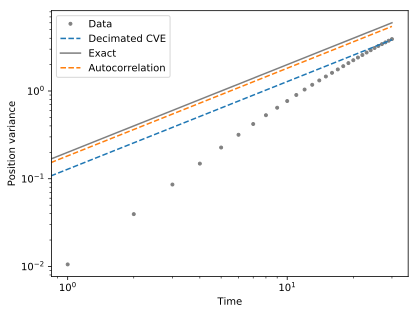

# Diffusivity estimators

When we want to estimate the diffusivity of a random walker based on its trajectory, fitting a power-law to its variance might not be the best option.

## Covariance-based estimator

Let us first consider the case of classical Brownian motion, for which we have access to discrete positions, measured at a frequency much lower than the inverse correlation time.

We first make such a random walker:

```python
from pylab import *
import BrownTrack as BT

u0 = .1
N = 10

# initial locations

for _ in range(N) :
    trajectories.addTrajectory( BT.trajectory( normal( scale = u0, size = 2 ) ) )

# time loop

for _ in range(10) :
    trajectories.grow( new_points = trajectories.getEnds() + normal( scale = u0, size = ( N, 2 ) ) )
```
We have a small number of short trajectories. Here is how they look like

```python
for traj in trajectories.live_trajectories :
    ax.plot( traj.x, traj.y, color = 'tab:blue', alpha = .5 )
```


The function `BT.diffusivity_2D` uses a covariance-based estimator to estimate the diffusivity from the trajectories:

```python
Dx, Dy = BT.diffusivity_2D( trajectories.live_trajectories )
```
The default estimator is the one proposed here:

*Frishman, A., & Ronceray, P. (2020). [Learning force fields from stochastic trajectories](https://doi.org/10.1103/PhysRevX.10.021009). Physical Review X, 10(2), 021009.*

To check it, we first plot the variance of the positions as a function of time:

```python
from bindata import bindata

disp = BT.dispersion_2( trajectories.getAllTrajectories(), dim = 'y' )

binned_data = bindata( disp['time'], disp['y'], nbins = 10 )
t, _ = binned_data.apply(mean)
_, sigma = binned_data.apply(var)

plot( t, sigma, 'o', color = 'grey', label = 'Data' )
```

We then compare with the estimator result, and the theoretical value:

```Python
t_th = linspace( min(t), max(t), 5)
plot( t_th, 2*Dy*t_th, '--', label = 'CVE' )
plot( t_th, u0**2*t_th, '-', color = 'grey', zorder = -1, label = 'Exact' )
legend()
```


The covariance-based estimator provides a reliable estimate in this case.

## Auto-correlation function

### Ballistic bias

For an actual Brownian motion, we usually have access to position data at a frequency much lower than the inverse correlation time of the random walk.

However, for larger systems, the short-time, ballistic behavior of the trajectories can bias the estimate of the diffusion coefficient. The covariance-based estimator is sensitive to this issue.

Let us create a random walk whose correlation time `tau` is longer than the time step:

```python
from pylab import *
import BrownTrack as BT

tau = 10
u0 = .1
N = 100

trajectories = BT.bunch()

for _ in range(N) :
    trajectories.addTrajectory( BT.trajectory( [ 0., 0. ] ) )

ux, uy = normal( scale = u0, size = ( 2, N ) )

for _ in range(1000) :

    updated = rand(N) < 1/tau
    ux[updated], uy[updated] = normal( scale = u0, size = ( 2, sum(updated) ) )

    x, y = array( trajectories.getEnds() ).T
    x += ux
    y += uy

    trajectories.grow( new_points = array((x,y)).T )
```

The resulting trajectories are a series of ballistic segments:

```python
trajs = trajectories.live_trajectories

for traj in trajs[::10] :
    ax.plot( traj.x[:30*tau], traj.y[:30*tau], '.', ms = 1, color = 'tab:blue', alpha = .3 )
```



This oversampling affects the covariance-based estimator, although this problem can be bypassed by downsampling the data:

```python
Dx, Dy = BT.diffusivity_2D( trajs )
Dx_d, Dy_d = BT.diffusivity_2D( trajs, downsampling = int(3*tau) )
```

We now compare with the dispersion of the data:

```python
from bindata import bindata

disp = BT.dispersion_2( trajectories.getAllTrajectories(), dim = dim )

binned_data = bindata( disp['time'], disp[dim], nbins = 30 )
t, _ = binned_data.apply(mean)
_, sigma = binned_data.apply(var)

plot( t, sigma, 'o', color = 'grey', label = 'Data' )
ax_sig.plot( t_th, 2*Dy*t_th, '--', label = 'CVE' )
ax_sig.plot( t_th, 2*Dy_d*t_th, '--', label = 'Decimated CVE' )
```



Decimating the data is a good solution when the available trajectories are long enough. When the data is scarce, however, it might we wiser to use it all.

### Green-Kubo relation

The [Green-Kubo relation](https://en.wikipedia.org/wiki/Green%E2%80%93Kubo_relations) relates diffusivity to the auto-correlation of velocity. To use it, we first need to estimate this auto-correlation.

```python
alpha = BT.veloctiy_correlation( trajs, max_length = 100 )
plot( alpha['y'] )
```



As expected, the autocorrelation function peaks at about `u0**2`, and decreases exponentially with a characteristic time equal to `tau`.

We can thus use this curve to estimate the diffusivity (through the Green-Kubo relation) and the correlation time:

```python
D_tau = BT.autocorrelation_diffusivity( alpha )
print(D_tau)
```

```console
>>> {'D': {'x': 0.09178753912713372, 'y': 0.10977787398469314}, 'tau': {'x': 9.330907630608303, 'y': 10.794501660361616}}
```
We can then check the result:

```python
plot( t_th, 2*D_tau['D'][dim]*t_th, '--', label = 'Autocorrelation' )
```


This method is useful when the trajectories are short. For instance, if we limit the duration of all trajectories to `3*tau`, we get:



For even shorter trajectories, the estimate could probably be improved by fitting the form of the autocorrelation function, before taking its integral, to compensate for the cutoff.
