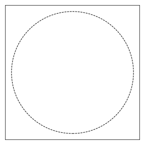
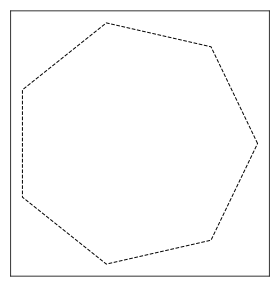
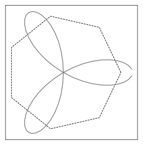
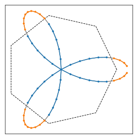

# Domain

A domain is a portion of a two-dimensional space, defined by a closed boundary---a disk, for instance.

## Disk

Let us define a domain bounded by a disk:
```python
import BrownTrack as BT
domain = BT.domain( 'Circle', { 'xy' : ( 0, 0 ), 'radius' : 1  } )
```
To show it, we turn it into a `matplotlib.patches` object:
```python
from pylab import *
gca().add_patch( domain.get_patch() )
```



## Polygon

A domain can also be bounded by a polygon:
```python
theta = linspace(0,2*pi, 8 )
domain = BT.domain( 'Polygon', { 'xy' : array( [ cos(theta), sin(theta) ] ).T  } )
```


We can compute the area of the domain:
```python

print( domain.get_area() )
```
```console
>>> 2.7364101886381045
```


## Cookie cutter

The point of defining a domain is to be able to tell apart what's inside and what's outside. Let us define a trefoil trajectory that crosses the domain's boundary:
```python
theta = linspace( 0, pi, 61 )[1:-1]
r = 1.2*cos(3*theta)
x = r*cos(theta)
y = r*sin(theta)

traj = BT.trajectory( points = array( [x, y ] ).T  )

plot( traj.x, traj.y, color = 'grey' )
```
The result looks like this:



Now, we would like to split this curve into pieces, based on these pieces laying inside or outside the domain. To do so, we use the `cookie_cutter` function:
```python
inside, outside = domain.cookie_cutter( traj )
print( len( inside ), len( outside ) )
```
```console
>> 3 4
```
There are four pieces outside, and three inside. We can plot them in different colors:
```python
for traj in inside :
    plot( traj.x, traj.y, marker = '.', color = 'tab:blue' )

for traj in outside :
    plot( traj.x, traj.y, marker = '.', color = 'tab:orange' )
```

