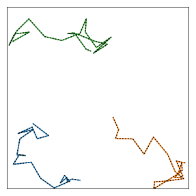
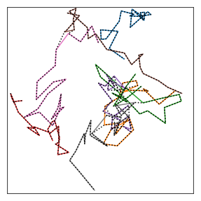

# Track random walkers

## Easy tracking

We first create a bunch of trajectories that represent an actual random walker.

```python
import BrownTrack as BT
from pylab import *

actual = BT.bunch()

for _ in range(3) :
    actual.addTrajectory( BT.trajectory( rand(2) ) )
```

This collection of trajectories will serve as our data. We now create another bunch that's supposed to track these trajectories.

```python
tracker = BT.bunch()
tracker.assign( actual.getEnds(), mismatch_length = .2 )
```

To evolve the trajectories of the actual walker, that is, to generate our synthetic data, we need a time loop. At each time step, we add a new point to each trajectory.

```python
for t in range(20) :

    for traj in actual.live_trajectories :

        x, y = array( traj.getEnd() ) + 0.2*( rand(2) - array( [ .5, .5 ] ) )

        ########### boundaries

        if x < 0 :
            x = - x
        if x > 1 :
            x = 2 - x
        if y < 0 :
            y = - y
        if y > 1 :
            y = 2 - y

        traj.addPoint( [ x, y ] )
```

We now want to track these walkers. To do so, we need to assign every new point to the tracker trajectories. We simply add the following line to the above loop.

```python
    tracker.assign( actual.getEnds(), mismatch_length = .2 )
```

Finally, we can plot the result.

```python
for trajectory in actual.live_trajectories :
    plot( trajectory.x, trajectory.y )

for trajectory in tracker.getAllTrajectories() :
    plot( trajectory.x, trajectory.y, ':k' )
```



In this case, the tracking is perfect, but it's not always so easy.

## Tracking issues

### Crowding

When there are too many walkers, they can find themselves too close to each other for correct assignment. The above code with more walkers yields:



The tracker trajectories sometimes cross over each other.
