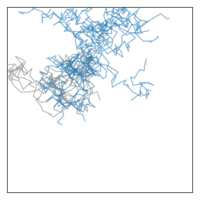
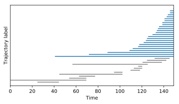

# Time line

Trajectories in a bunch can appear and time as their population evolves. New trajectories are born, while others die.

## Population of bugs

We grow a population of random walkers in a square Petri dish. As a bug roams accross the dish, it may split into two bugs---or die.

Let us first seed the dish with a single, centered bug.

``` python
population = BT.bunch( live_trajectories = [BT.trajectory( X = [0.5,0.5] ) ], dead_trajectories = [] )
```
We then start a time loop through which the population moves, grows, and dies.

### Random walk

The random walk part is straightforward, but confining the bugs into the dish requires a few more lines to encode the boundary conditions.

``` python
for t in range(150) :

    ########### Brownian motion

    for traj in population.live_trajectories :

        x, y = array( traj.getEnd() ) + 0.1*( rand(2) - array( [ .5, .5 ] ) )

        ########### boundaries

        if x < 0 :
            x = - x
        if x > 1 :
            x = 2 - x
        if y < 0 :
            y = - y
        if y > 1 :
            y = 2 - y

        traj.addPoint( [x, y ] )
```

### Splitting

Every so often, a bug splits in two. When this happens, the mother trajectory goes on, and a new trajectory appears.
``` python
        if rand() < .03 :
            population.addTrajectory( BT.trajectory( X = traj.getEnd(), birth_time = t ) )
```

### Death

At teach time step, fate chooses a few victims and their trajectories end.
``` python
    population.kill( where( rand( len( population.live_trajectories ) ) < .01 )[0] )
```

### Petri dish

After 150 time steps, we can have a look at the state of the population.
``` python
for trajectory in population.dead_trajectories :
    plot( trajectory.x, trajectory.y, color = 'grey' )

for trajectory in population.live_trajectories :
    plot( trajectory.x, trajectory.y, color = 'blue' )
```
The results vary wildly between simulation runs. Here is an example, where the trajectories of dead bugs appear in grey:



## Timeline

In our simulation, all bugs share a single ancestor, but not all are born at the same time. Some also die along the way. We can plot a timeline to summarize their collective fate.
``` python
h = 0

for traj in population.dead_trajectories :
    plot( [ traj.birth_time, traj.getEndTime() ], [h]*2, dead_color )
    h += 1

for traj in population.live_trajectories :
    plot( [ traj.birth_time, traj.getEndTime() ], [h]*2, live_color )
    h += 1
```

Below is the corresponding timeline. Overall, the population is doing fine.


