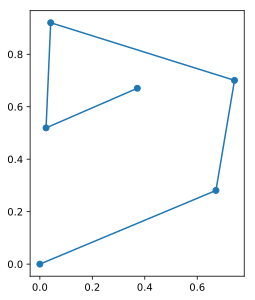

# Trajectory

## Single trajectory

A trajectory is just a series of points with a starting time. For instance:
``` python
import BrownTrack as BT

traj = BT.trajectory( X = ( 0, 0 ) )
```
creates a trajectory that starts from the origin at time 0.

To add new points to this nascent trajectory:
``` python
from pylab import *

for _ in range(5) :
    traj.addPoint( rand(2) )
```
We can now plot the result.
``` python
plot( traj.x, traj.y, 'o-' )
```

