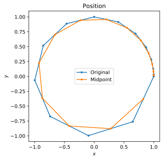
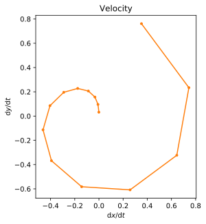
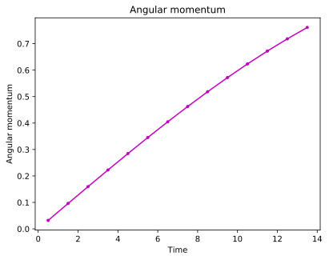

# Velocity

## Circular trajectory

Let's define a circular trajectory:
``` python
import BrownTrack as BT

traj = BT.trajectory( X = ( 1, 0 ) )

from pylab import *

for t in linspace(0,1,15)[1:]**2 :
    point = exp(1j*t*2*pi)
    # plot( *point, 'o' )
    traj.addPoint( ( real(point), imag(point) ) )
```
We can plot the result:
```python
plot( traj.x, traj.y )
```
This is the blue line in the figure below.



## Velocity

To calculate the velocity of the above trajectory, we simply write:
```python
traj_u = traj.diff()
```
The result is the orange line in the figure below. Due to the discrete differentiation, there is one less data point than in the original trajectory.



## Midpoints

The discrete differentiation of a trajectory generate midpoint values. The trajectory can be mapped onto these midpoints:

```python
traj = traj.diff_companion()
```
The result is the orange line on the first figure above.

## Angular momentum

It is now straightforward to calculate the angular momentum of the trajectory:

```python
angular_momentum = traj.x*traj_u.y - traj.y*traj_u.x
plot( traj.get_time_list(), angular_momentum, 'm.-')
```


